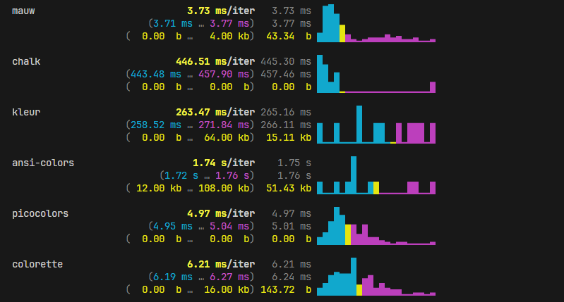

<p align="center" style="background-color: #fff;">
  
</p>

<p align="center">
  <a href="./LICENSE">
    
  </a>
  <a href="https://npmjs.org/package/mauw">
    
  </a>
  <a href="https://npmjs.org/package/mauw">
    
  </a>
  <a href="https://packagephobia.now.sh/result?p=mauw">
    
  </a>
  <a href="https://bundlephobia.com/result?p=mauw">
    
  </a>
</p>

<p align="center">
  <strong>A modern, lightweight library for handling colors, styles, and Unicode characters in the terminal.</strong>
</p>

**mauw** is a library written in TypeScript focused on efficient color and style management for the terminal. It provides modern utilities for working with RGB, HEX, backgrounds, static variants, and Unicode character support, offering smart fallbacks for environments where certain symbols or colors are not available.

Designed with a focus on performance, strong typing, and minimal weight, **mauw** is ideal for CLIs, development tools, and terminal applications that seek consistent visual output without sacrificing speed or simplicity.

## Design philosophy

mauw prioritizes explicitness, composability, and performance.
No hidden state, no magic globals, no unnecessary abstractions.

## Features

- RGB, HEX, and background color support
- Smart Unicode fallbacks for incompatible terminals
- Fully typed API (TypeScript-first)
- Extremely small bundle size
- Terminal-focused, no browser bloat
- ESM-ready

## Performance

mauw is designed to be fast and lightweight, with minimal startup and runtime overhead,
making it suitable even for short-lived CLI commands.

## Compared to other libraries

- Smaller than most popular color libraries
- Stronger typing than legacy solutions
- No ANSI magic leaking into user code

## Why mauw?

- Designed for performance-critical CLI tools
- Minimal runtime overhead
- Strong typing without sacrificing speed
- Predictable output across terminals

## Install

```bash
npm install mauw
```

## Usage

> mauw provides a simple and expressive API for styling terminal output using colors and Unicode-safe utilities.

mauw is optimized for functional composition.
Property chaining is supported for convenience,
but functional composition is the recommended and fastest approach.

### Basic colors

```ts
import mauw from 'mauw/colors';

console.log(
  mauw.rgb(255, 0, 0)('Red text'),
  mauw.hex('#00ff99')('Green text')
);
```

### Background colors

```ts
import mauw from 'mauw/colors';

console.log(
  mauw.bgRgb(30, 30, 30)('Dark background'),
  mauw.bgHex('#1e1e1e')('HEX background')
);
```

### Composing styles

```ts
import mauw from 'mauw/colors';

console.log(mauw.bgRgb(200, 40, 40).bold('Highlighted text'));
console.log(mauw.bgRgb(200, 40, 40)(mauw.bold('Highlighted text')));
```

### Static color definitions

```ts
import { COLORS_ENABLED } from 'mauw/colors';

if (COLORS_ENABLED) {
  console.log('Colors are enabled in this terminal');
}
```

### Unicode-safe output

```ts
import character from 'mauw/characters';

console.log(character.checkmark, 'Task completed');
```

## Performance

> See the full benchmark suite in the `bench/` directory.



mauw is built with performance as a first-class concern.
Its core focuses on minimizing allocations, avoiding unnecessary string operations, and favoring functional composition over heavy chaining mechanisms.

In practice, this results in:

- Significantly lower execution time compared to common terminal color libraries
- Near-zero allocations in most simple color operations
- Extremely fast nested styling and composition
- Minimal overhead even in short-lived CLI processes

> Benchmarks show that mauw consistently outperforms popular alternatives in basic coloring, nested styles, and composition patterns, while also producing less garbage for the runtime to clean up.

### Verifying performance

All performance claims are fully reproducible.

To manually verify and compare results, you can run the benchmark suite included in the repository:

```bash
npm install
node bench/load.ts
node bench/dryrun.ts
node bench/performance.ts
```


> This will execute real-world scenarios comparing mauw against other well-known libraries, allowing you to validate execution time, memory usage, and composition cost on your own machine.

> Performance may vary depending on runtime, CPU, and OS, but relative efficiency remains consistent.

## Contributors

Thanks to these amazing people:

<!-- ALL-CONTRIBUTORS-LIST:START - Do not remove or modify this section -->
<!-- prettier-ignore-start -->
<!-- markdownlint-disable -->
<!-- markdownlint-restore -->
<!-- prettier-ignore-end -->

<!-- ALL-CONTRIBUTORS-LIST:END -->

## License

MIT © Kkotero

## Contributing

Issues and pull requests are welcome.
